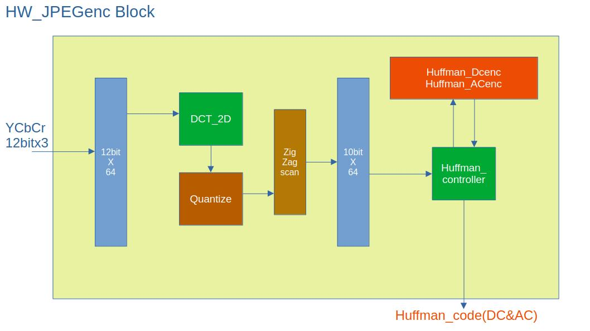

# HW JPEG Encoder (Google DSLX & Verilog HDL)

## Introduction

HW JPEG Encoder is a hardware JPEG encoder implemented using Google's DSLX and Verilog HDL.  
This project was developed as an experimental design to realize JPEG encoding in hardware.  
By leveraging the high-level description of DSLX and the low-level implementation of Verilog HDL, the project pursues an efficient and flexible hardware design.

*Note: This project was created for educational and experimental purposes. Advanced production features and high-speed optimizations are topics for future consideration.*
*Note: This project was created for educational and experimental purposes. Advanced production features and high-speed optimizations are topics for future consideration. Code is currently being refactored.*

## Directories

- **HW_python_model:**  
  Contains the Python model for hardware operation. It includes models used to simulate the encoder’s behavior in Python and code for functional verification.

- **cocotb_sim:**  
  Holds the files for the simulation environment using the cocotb framework. This includes scripts and configuration files for verifying the Verilog HDL code with a Python-based testbench.

- **image:**  
  Stores image files used as input or output samples for JPEG encoding. These images serve as test cases during simulation and functional verification.

- **ir_dir:**  
  Manages the intermediate representation (IR) files generated from high-level descriptions such as DSLX. These files are used as intermediate artifacts during the design process for analysis and debugging.

- **python:**  
  Contains auxiliary Python scripts and tools used across the project. These scripts are used for simulation automation, data analysis, and result visualization.

- **src:**  
  Aggregates the complete source code of the project. This includes DSLX code and other necessary source files for the design.

- **verilog:**  
  Contains the Verilog HDL source code for the hardware JPEG encoder. This directory includes implementations of various modules, testbench top modules, and design files for FPGA synthesis or simulation.

## Block Diagram

- The block diagram shows the circuit after the RGB to YCbCr conversion stage.
- Except for the 8x8 image data buffer, all blocks are described using DSLX.  

## Image

- Q=25 Output JPEG Image  

## Environment of Evaluation

### Simulation

- Icarus Verilog and GtkWave on Ubuntu Linux

### FPGA

- Synthesizable for gowin GW5AST-LV138PG484

## License

MIT License

## What I’ve Learned

- During debugging, I discovered that due to a mistake where a register was not reset, processing large images resulted in distorted outputs. This led me to experience what the industry refers to as "indeterminate propagation."
- The Huffman AC algorithm did not work by simply using the same approach as the Python code. Instead, I devised my own algorithm and implemented it in DSLX.
- I made an error in understanding the specification for handling the DC component between blocks. Although the JPEG algorithm itself is not overly complicated, misunderstandings of the specification can waste hours of debugging.
- The block noise in both the horizontal and vertical directions is caused by the fact that the DCT does not use floating-point sine and cosine functions. In commercial hardware, patented techniques are likely used to eliminate this.
- Most of the data is encoded using the Y channel's Huffman code, while the Cb and Cr channels contain relatively few Huffman-coded data. This demonstrates that even with limited frequency data in the color-difference signals, the human eye can still perceive a high-quality image.
- Reducing the processing time by even one clock cycle, decreasing the number of multipliers by one, or saving a single byte of memory—these are the core challenges for a logic designer. Although I have identified over 20 improvement opportunities in the current design, this project focuses only on achieving functional verification.

## Japanese Explanation Note

[https://note.com/dreamy_stilt3370/n/n9b90f30129b8](https://note.com/dreamy_stilt3370/n/n9b90f30129b8)

## Written by

NISHIHARU  
[https://note.com/dreamy_stilt3370](https://note.com/dreamy_stilt3370)

## Special Thanks

- [Python JPEG Encoder](https://github.com/fangwei123456/python-jpeg-encoder)
- [Python JPEG Decoder](https://github.com/yohhoy/picojdec)
