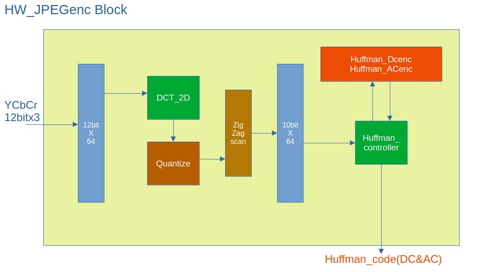

# HW JPEG Encoder (Google DSLX & Verilog HDL)
## Introduction
HW JPEG Encoder は、Google の DSLX と Verilog HDL を用いて実装されたハードウェア JPEG エンコーダです。
本プロジェクトは、ハードウェアにおける JPEG エンコード処理を実現するための設計実験として開発されました。
DSLX による高水準な記述と、Verilog HDL による低水準な実装の両面から、効率的かつ柔軟なハードウェア設計を追求しています。

※なお、本プロジェクトは教育・実験目的で作成されています。実際の製品向け機能や高速化は今後の検討課題となります。

## Directories
- HW_python_model:ハードウェア動作の Python モデルを格納します。エンコーダの挙動を Python 上でシミュレートするためのモデルや、動作検証用のコードが含まれています。
- cocotb_sim:cocotb フレームワークを用いたシミュレーション環境のファイル群です。Verilog HDL コードを Python ベースのテストベンチで検証するためのスクリプトや設定ファイルが格納されています。
- image:JPEG エンコードの入力または出力サンプルとなる画像ファイルを配置します。シミュレーションや動作検証時のテストケースとして利用されます。
- ir_dir:DSLX など高水準記述から生成された中間表現（Intermediate Representation, IR）ファイルを管理します。設計過程の中間成果物として、解析やデバッグに利用されます。
- python:プロジェクト全体で利用する補助的な Python スクリプトやツール群を配置します。シミュレーションの自動化、データ解析、結果の可視化などに使用されます。
- src:プロジェクトのソースコード全体をまとめたディレクトリです。DSLX で記述されたコードや、その他設計に必要なソースファイルが含まれます。
- verilog:ハードウェア JPEG エンコーダの Verilog HDL ソースコードを格納します。各モジュールの実装、テスト用トップモジュールなど、FPGA やシミュレーション向けの設計ファイルが集約されています。

## Block図
- RGB to YCbCr変換回路後のブロック図です。
- 8x8画像データバッファ以外の各ブロックはDSLXで記述されています。

## モジュール仕様
- DSLXコードからVerilogコードに変換する時は下記のPIPELINEを指定してください。  

| モジュール名    | 機能                    | PIPELINE数 |
|-----------------|-------------------------|------------|
| DCT_1D          | DCT(離散コサイン変換)  | 3          |
| Zigzag_scan     | ジグザグスキャン       | 1          |
| Quantize        | 量子化                 | 2          |
| Huffman_DCenc   | DCハフマンコード生成   | 1          |
| Huffman_ACenc   | ACハフマンコード生成   | 4          |

## Image
- Q=25 Output JPEG Image  

  
## Environment of Evaluation
### Google DSLX
- [Google DSLX](https://google.github.io/xls/dslx_reference/)

### Simulation
- Icarus Verilog and GtkWave on ubuntu linux

### FPGA
- gowin GW5AST-LV138PG484 向けに合成可能でした。

## License
MIT License

## わかったこと
- デバッグ時に、どこかでレジスタをリセットしていないミスにより、大きなサイズの画像を処理すると処理後の画像が乱れる。業界用語の「不定の伝播」に陥ってました。
- ハフマンACのアルゴリズムはPythonコードそのままのアルゴリズムとは行かないので自作アルゴリズムを考案したDLSXコードを記述しました。
- ブロック間のDC成分の処理に仕様の理解ミスをしていました。JPEGのアルゴリズム自体は難しくはないが、仕様の理解ミスをしているとデバッグに半日単位で時間を浪費してしまう。
- 縦横のブロックノイズはDCTが浮動小数点のsin,cosなどを使用していない事が原因です。商用のハードウェアでは、これを消す工夫が特許なりになってるのでしょう。
- データの大半がYのハフマンコードである。Cb,Crのハフマンコードのデータは少数。色差信号の周波数成分のデータが少なくても人間には綺麗な画像として認識されるということですね。
- 処理を1CLKでも短縮する、乗算器の数を1個でも少なくする、メモリを1バイトでも節約する、のがロジック設計者の本職の仕事ですが。私でも現状の設計から20箇所以上の改善案は思いつくところですが、ここでは動作確認レベルまでとします。

## 日本語説明Note
https://note.com/dreamy_stilt3370/n/n9b90f30129b8

## Written by
NISHIHARU
https://note.com/dreamy_stilt3370

## Special Thanks
- Python JPEGエンコーダー https://github.com/fangwei123456/python-jpeg-encoder
- Python JPEGデコーダー https://github.com/yohhoy/picojdec
